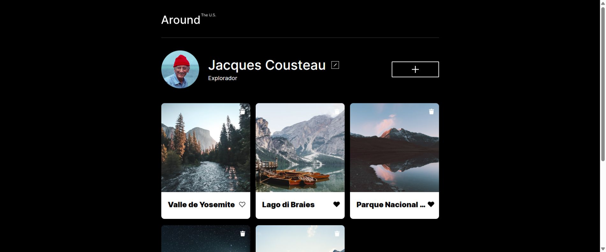
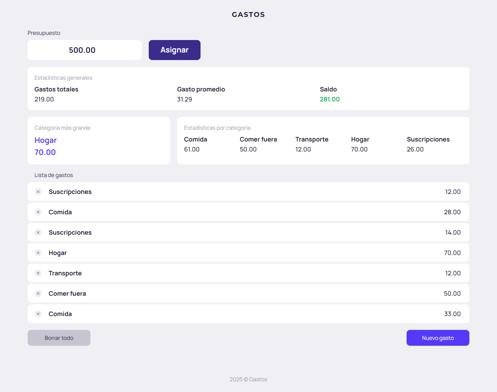
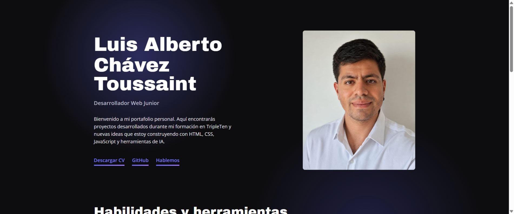
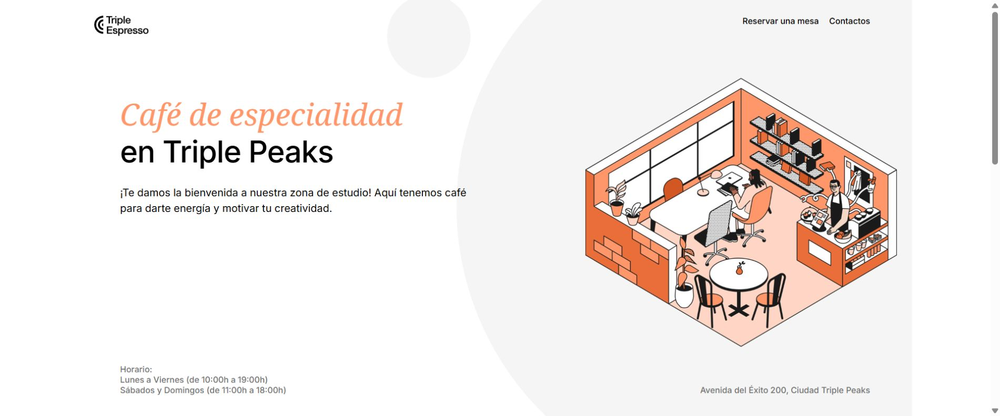

<h1>¡Bienvenido a mi GitHub! 👾</h1>

<h2>Luis A. Toussaint</h2>

<strong>Desarrollador Web Frontend Junior · Ingeniero en Redes Computacionales</strong>

<em>«Me gusta entender cómo funcionan las cosas y convertir problemas en soluciones prácticas».</em>

---

## 👨‍💻 Acerca de mí

Soy profesional de Tecnologías de la Información con más de tres años de experiencia en soporte, gestión de servicios y procesos de TI. Actualmente amplío mi perfil hacia el **desarrollo web frontend** mediante mi formación en TripleTen y proyectos construidos con HTML, CSS, JavaScript y TypeScript.

Durante mi formación he trabajado con interfaces responsivas, manipulación del DOM, programación orientada a objetos, consumo de APIs y programación asíncrona. Utilizo Git y GitHub como parte de mi flujo de trabajo y procuro mantener el código organizado, claro y fácil de mantener.

Mi objetivo es crecer como **Frontend Developer**, combinando mi experiencia tecnológica, pensamiento analítico y capacidad para resolver problemas con el desarrollo de productos digitales funcionales y fáciles de usar.

## 🛠️ Habilidades, lenguajes y herramientas

- **Frontend:** HTML5, CSS3, JavaScript y TypeScript.
- **Diseño:** Responsive Design, Flexbox, CSS Grid y metodología BEM.
- **JavaScript:** DOM, eventos, módulos ES, Promises, `async/await` y Fetch API.
- **Desarrollo:** programación orientada a objetos, APIs REST y control de versiones.
- **Experiencia adicional:** Linux, redes, soporte y gestión de servicios de TI.

## 🚀 Proyectos

### 01 · Alrededor de los EE. UU.

  

Galería interactiva conectada a una API para administrar un perfil, publicar y eliminar tarjetas, marcar contenido con «Me gusta» y editar el avatar.

- **Reto:** mantener una interfaz responsiva sincronizada con los datos de un servidor.
- **Solución:** organicé la aplicación en clases, implementé validación en tiempo real y conecté las acciones mediante una API REST.
- **Aprendizaje:** reforcé TypeScript estricto, programación orientada a objetos, composición, asincronía y manejo de errores.

---

### 02 · Gestor de gastos

  

Aplicación web para registrar gastos, asignar un presupuesto y consultar estadísticas generales y por categoría.

- **Reto:** convertir una interfaz estática en una herramienta que actualizara información financiera de forma clara.
- **Solución:** implementé el registro y eliminación de gastos, cálculos de saldo y promedio, estadísticas y persistencia local.
- **Aprendizaje:** fortalecí la manipulación del DOM, la separación de responsabilidades y el control de versiones.

---

### 03 · Portafolio personal

  

Tarjeta de presentación digital que reúne mi perfil, habilidades, proyectos, currículum y canales de contacto.

- **Reto:** presentar mi trayectoria de forma clara y accesible desde computadoras, tabletas y teléfonos.
- **Solución:** desarrollé una interfaz modular, organicé los estilos por bloques y adapté el diseño mediante media queries.
- **Aprendizaje:** reforcé layouts responsivos, BEM, imágenes fluidas y la construcción de una identidad visual coherente.

---

### 04 · Triple Espresso

  

Landing page para una cafetería ficticia con información del establecimiento, navegación interna y un formulario para reservar mesa.

- **Reto:** transformar un brief de diseño en una página ordenada, atractiva y fácil de recorrer.
- **Solución:** construí HTML semántico, maqueté las secciones con CSS y Flexbox e implementé campos obligatorios y estados interactivos.
- **Aprendizaje:** fortalecí maquetación, posicionamiento, formularios, organización de recursos y fidelidad visual.

## 📊 Actividad en GitHub

## 🤝 Contacto

Actualmente continúo desarrollando nuevos proyectos y ampliando mis conocimientos en desarrollo frontend.

